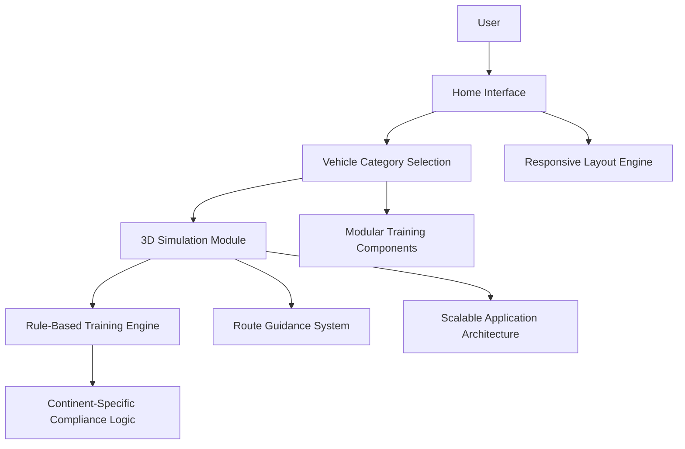

<div align="center">

# 🌍 3D Global Driving Learning Application

### A scalable, simulation-based 3D driving education platform designed to train users across 7 continents with region-specific traffic regulations and multi-environment vehicle learning.


<br/>


</div>

---

## 🚘 Overview

**3D Global Driving Learning Application** is a responsive and modular simulation-based learning platform built to train users under **continent-specific transport rules** across multiple operational environments. The platform is designed as a **3D-first learning system**, enabling immersive interaction, structured route guidance, and scenario-based training experiences for global users.

The application supports **7 global regions** and **4 major vehicle environments**, making it a strong concept for international training systems, safety education tools, and scalable multi-domain simulation products.

---

## 🌐 Project Scope

This platform is designed to:

- Support training across **7 global regions**
- Cover **4 transportation domains**
- Integrate **rule-based compliance logic**
- Provide **structured simulation-driven learning**
- Deliver a **responsive multi-device experience**
- Enable a **3D interactive learning workflow**

---

## 🧭 Application Preview

> Replace the placeholders below with your real project screenshots or rendered 3D interface captures.

| Interface | Preview |
|----------|---------|
| **Home Interface** | `Add Screenshot Here` |
| **Vehicle Category Selection** | `Add Screenshot Here` |
| **3D Simulation Module** | `Add Screenshot Here` |
| **Rule-Based Training View** | `Add Screenshot Here` |

---

## ✈️ Supported Vehicle Categories

| Category | Description |
|---------|-------------|
| **Land Transportation** | Road-based driving systems with traffic and route learning. |
| **Air Transportation** | Flight-oriented operational learning with control-based logic. |
| **Water Surface Navigation** | Surface-level navigation simulation for marine vehicle guidance. |
| **Underwater Vehicle Systems** | Specialized learning environment for underwater operational training. |

Each category is modeled with its own **operational logic**, **training rules**, and **safety-focused behavior simulation**.

---

## ✨ Core Features

- 🌍 Continent-specific traffic rule structure
- 🧩 Modular learning system
- 🛣️ Route-based guidance
- 🕹️ 3D simulation-driven interface
- 📱 Responsive UI design
- 🏗️ Scalable architecture
- 🧠 Rule validation support
- 🚀 Future-ready technical design

---

## 🛠 Tech Direction

| Layer | Technology / Concept |
|------|-----------------------|
| **Frontend** | HTML, CSS, JavaScript |
| **3D Experience** | Three.js-based simulation layer |
| **UI Design** | Responsive modular interface |
| **Architecture** | Scalable component-based structure |
| **Version Control** | Git, GitHub |

<div align="center">


</div>

---

## 🏗️ 3D Architecture Design



---

## 🧩 System Layers

The system is divided into several structured layers:

| Layer | Function |
|------|----------|
| **Modular Training Components** | Separate learning units for different transportation environments. |
| **Rule Validation Framework** | Applies region-specific logic and compliance-based checks. |
| **3D Simulation UI Layer** | Delivers immersive and visual training interactions. |
| **Responsive Layout Engine** | Ensures compatibility across desktop, tablet, and mobile devices. |

This architecture makes the platform extensible and suitable for future enterprise-grade expansion.

---

## ⚙️ Installation

### 1. Clone the repository

```bash
git clone <repository-name>
```

### 2. Navigate to the project folder

```bash
cd <repository-name>
```

### 3. Run locally

Open `index.html` in your browser.

> If your project later includes a 3D JavaScript module setup, you may also run it through a local development server for smoother asset loading.

---

## 🧠 Engineering Value

This project demonstrates:

- system-level architecture thinking,
- multi-environment simulation modeling,
- scalable frontend engineering,
- modular UI and logic separation,
- and 3D-based interactive learning design.

It is especially useful as a concept for **global training platforms**, **simulation education systems**, and **future intelligent transport learning products**.

---

## 🚀 Future Roadmap

- User authentication system
- Real-time 3D simulation engine
- AI-driven training adaptation
- Mobile application version
- Cloud-based deployment
- Performance analytics dashboard
- Backend API integration
- Region-aware user progress tracking

---

## 🤝 Contribution Guidelines

To contribute:

1. Fork the repository
2. Create a feature branch
3. Commit clean and structured updates
4. Submit a pull request
5. Maintain modular architecture and descriptive commit messages

```bash
git checkout -b feature/add-3d-simulation-scene
git commit -m "Add modular 3D vehicle environment structure"
git push origin feature/add-3d-simulation-scene
```

---

## 👨‍💻 Author

Developed as a scalable simulation-focused learning concept to strengthen skills in **frontend architecture**, **multi-environment system design**, and **3D interactive application structuring**.

<div align="center">

### Train globally. Simulate intelligently. Learn in 3D.

</div>
